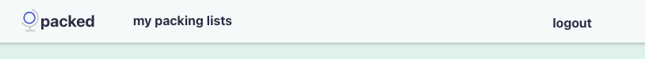
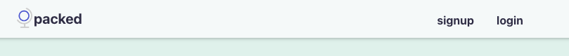
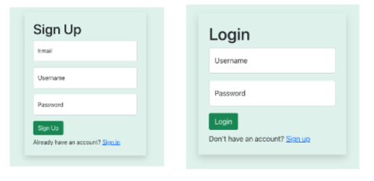
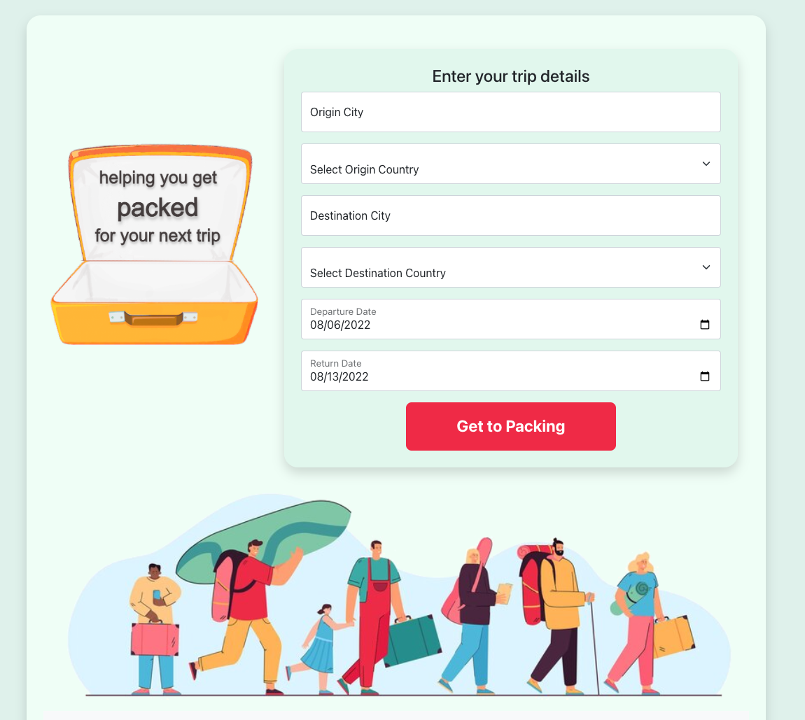
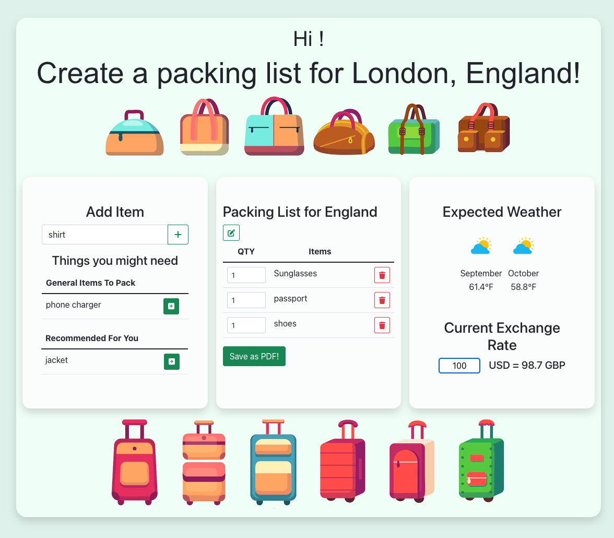
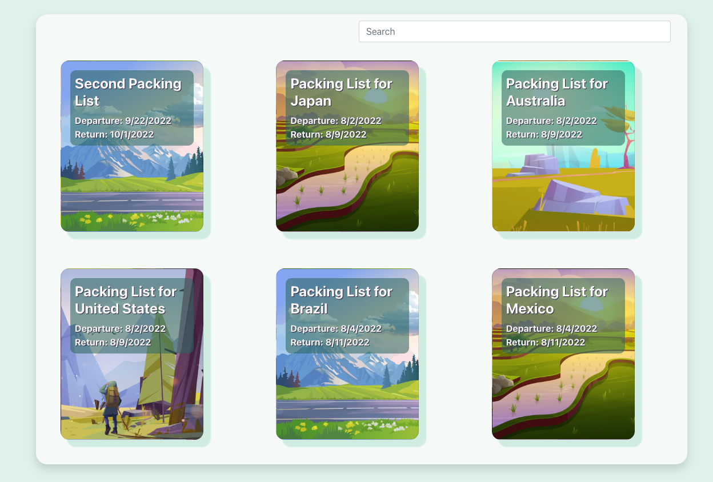
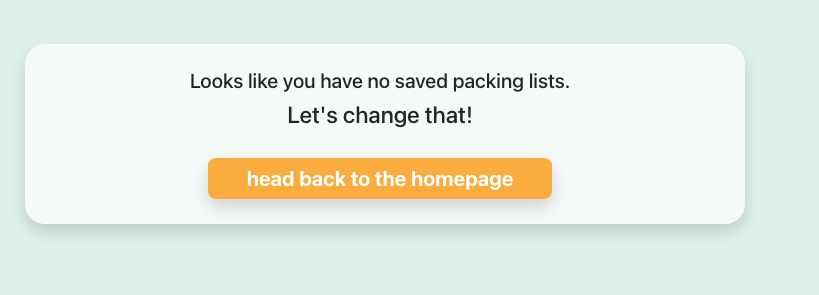
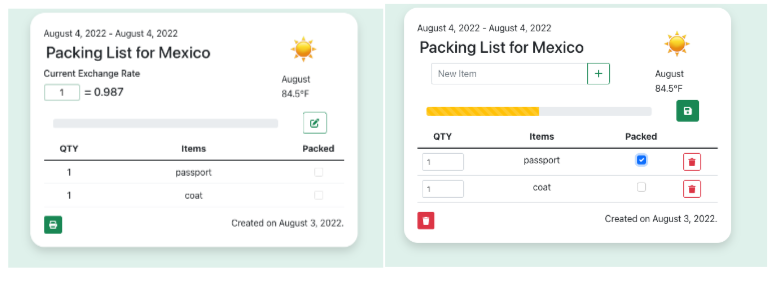

# Graphical Human Interface

## Navbar

Options on the navbar dependent on whether user is logged in or not. If logged in, the user will have an extra link that leads to their packing lists page. If not logged in, will be an option to login or sign up.

## Signup or Login

## Homepage

Whether or not the user is logged in, they will be able to enter details of their trip.

## Trip Details and Create Packing List Page

After hitting submit on the homepage, the user will be redirected to a page listing data based on their inputs. The page will include expected weather for their month(s) of travel and the current exchange rate between their origin and destination countries. If the desitination country uses the same currency as the origin country, the user will instead get a message rendered saying, "Looks like {destination} also uses {currency code}!"

The user can also update the input of currency for their origin location and get live updates for the amount in their destination's currency.

On this page, the user can now start building their packing list, which is broken down into three sections:

- One section will be an input where the user can type any items of their choosing to add to the packing list.
- One section will have pre-loaded suggestions for basic travel items, like a toothbrush, that the user add to their packing list
- Last section will have pre-loaded suggestions for travel items based on location, like a coat for a cold region or swim suit for a tropical region, that the user add to their packing list

Once the user has built their packing list, an non-authenticated user/ logged out user can save their list as a pdf or print it. A logged in user will be able to save their packing list. Once they hit the Create button, they will be directed to the detail page of their newly created packing list.

## Packing Lists Page

On this page, a logged in user can see the names of all of their packing lists and will be able to click on them to redirect to the details of that particular packing list.

A user without any saved packing lists will be greated with a message and button to navigate them back to the home page to start making a packing list.

## Packing List Page

On this page, the user can view the details of their saved packing list. They will also have the option to edit the list by adding new items, deleting items, adjusting quantities, and marking the item as packed. With these edits, the user can see the progress bar adjust accordingly. The user will also have the option to delete this list entirely. The page will also still contain weather and currency details.

