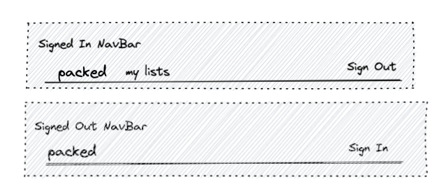
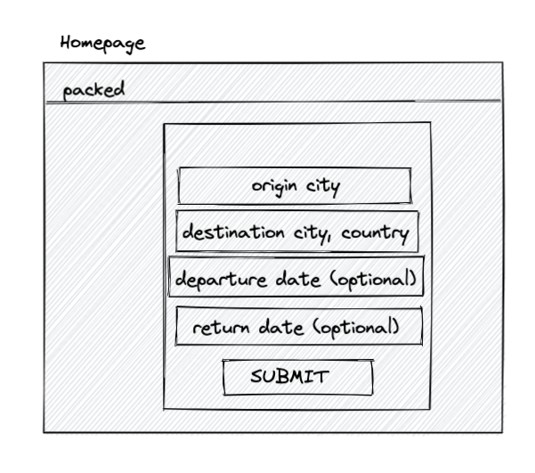
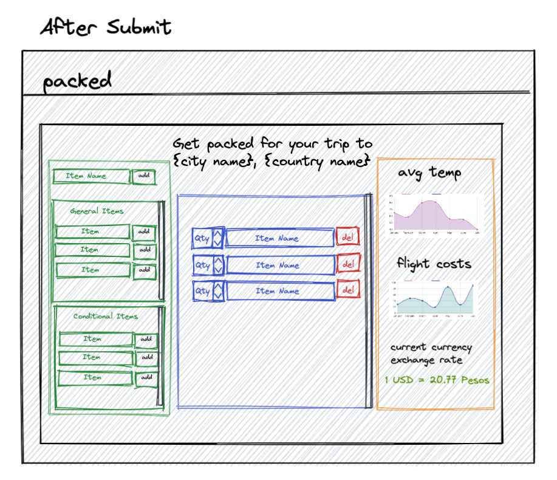
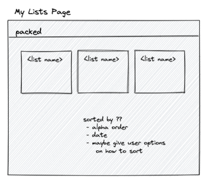
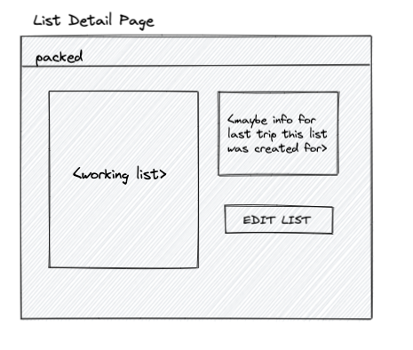

# Graphical Human Interface

## Navbar

Options on the navbar dependent on whether user is logged in or not.

## Homepage

Whether or not the user is logged in, they will be able to enter details of their trip.

## Trip Details and Create Packing List Page

After hitting submit on the homepage, the user will be redirected to a page listing data based on their inputs. The page will include charts to show average temps and average prices for the flights by using bootstrap react charts. On this page, the user can now start building their packing list, which is broken down into three sections:

- One section will be an input where the user can type any items of their choosing to add to the packing list.
- One section will have pre-loaded suggestions for basic travel items, like a toothbrush, that the user add to their packing list
- Last section will have pre-loaded suggestions for travel items based on location, like a coat for a cold region or swim suit for a tropical region, that the user add to their packing list

#### Resources for Charts:

([mdbootstrap charts](https://mdbootstrap.com/docs/react/advanced/charts/))
([devwares bootstrap charts](https://www.devwares.com/docs/contrast/react/chart/))

## Packing Lists Page

On this page, the user can see the names of all of their packing list and will be able to click on them to redirect to the details of that particular packing list

## Packing List Page

On this page, the user can view the details of their saved packing list. They will also have the option to edit the list. The page will also contain the details for the trip associated to this specific packing list.

